<p align="center">
  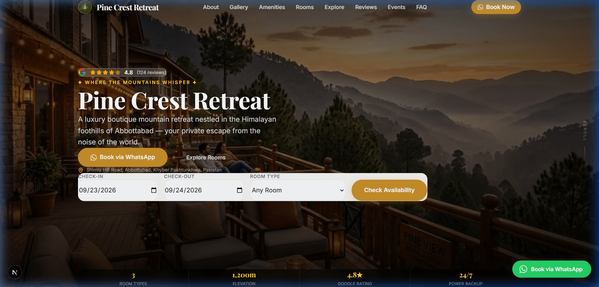
</p>

<h1 align="center">🏔️ Pine Crest Retreat — Luxury Boutique Hospitality Template</h1>

<p align="center">
  <strong>A production-ready, white-label Next.js 16 website template for boutique hotels, mountain resorts, and luxury guesthouses with a high-converting WhatsApp-first booking engine.</strong>
</p>

<p align="center">
  <a href="https://qi-hotels.vercel.app"></a>
  
  
  
  
  
</p>

<p align="center">
  <a href="../docs/demo-video.mp4" title="Watch full 1080p Walkthrough Video">
    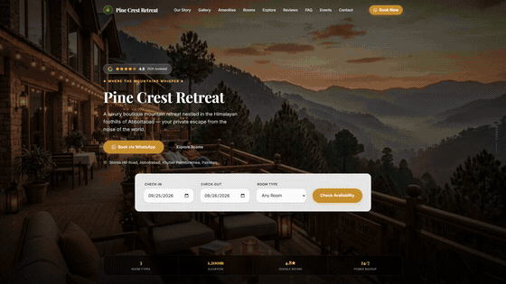
  </a>
</p>

<p align="center">
  <a href="../docs/demo-video.mp4">
    
  </a>
  &nbsp;
  <a href="https://qi-hotels.vercel.app">
    
  </a>
</p>

<p align="center">
  <a href="../docs/demo-video.mp4">▶️ <strong>Watch the full 60-second walkthrough (1080p)</strong></a> &bull; Direct high-res MP4 download (10.3 MB)
</p>

---

## 🚀 Live Demo

- **Production URL**: [https://qi-hotels.vercel.app](https://qi-hotels.vercel.app)
- **Primary Showcase**: Pine Crest Retreat (Abbottabad, Khyber Pakhtunkhwa, Pakistan)
- **Agency Credit**: Developed by [QI Tyrix](https://qi-tyrix.netlify.app)

---

## 🏗 System Architecture

Unlike traditional web applications requiring heavy databases or payment gateways, this template is built around a **WhatsApp-first conversion architecture**. In tourism markets (South Asia, GCC, Southern Europe, Southeast Asia), travelers overwhelmingly prefer direct messaging with hosts for custom arrangements, payment flexibility, and immediate confirmation.

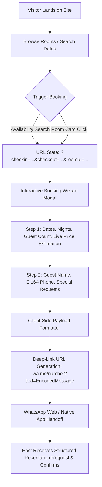

### Key Technical Architecture Highlights
- **Single Source of Truth (`site.config.ts`)**: Every piece of content, room definitions, gallery collections, social links, SEO tags, and brand colors is controlled by one typed file.
- **Dynamic CSS Variable Injection**: Brand colors from `site.config.ts` are injected directly into the HTML root as CSS custom properties with native `color-mix()` fallbacks. Change the hex values in configuration, and the entire site re-themes with zero CSS edits.
- **URL-Driven Modal State**: The booking wizard is synchronized with search params (`?booking=open&roomId=...`), enabling back-button history navigation, direct room sharing links, and smooth browser transitions.
- **Zero-Friction Conversion**: Built-in 2-step booking modal with automatic night calculations, guest capacity checks, local-time timezone safety, and instant WhatsApp dispatch.

---

## ✨ Features

### 🏨 Guest Experience & Booking
- **WhatsApp-First Booking Wizard**: 2-step reservation flow with live stay cost calculation, night count detection, and international E.164 phone support.
- **Availability Search Bar**: Check-in, check-out, and room category filter with timezone-safe date parsing and auto-adjusting stay minimums.
- **Interactive Room Showcase**: Featured popular badges, occupancy caps, amenity chips, and photo lightbox modals for every room tier.
- **Smart Promotional Modal**: Unobtrusive, exit-intent / scroll-depth triggered discount popup with backdrop click and `Escape` keyboard dismissal.

<p align="center">
  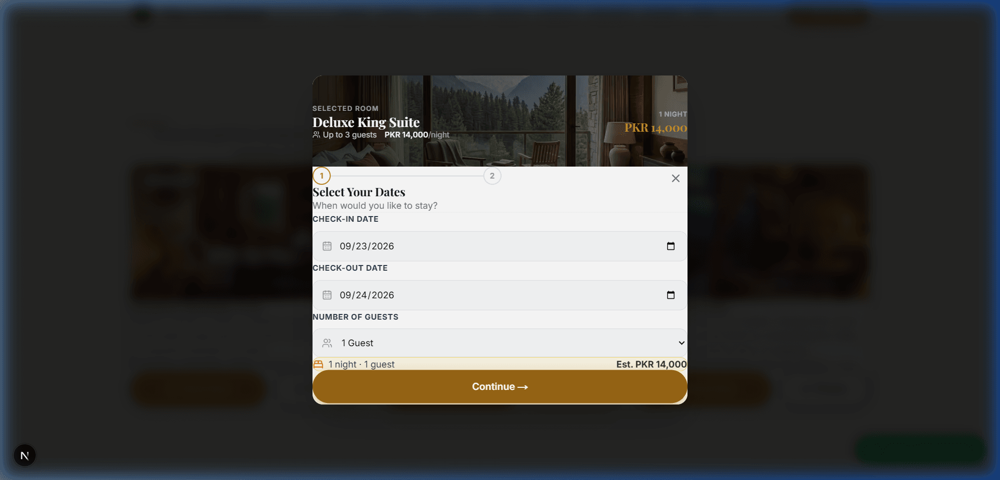
</p>

### 📸 Media & Discovery
- **Categorized Masonry Gallery**: Filter photos by category (*Nature*, *Rooms*, *Dining*, *Exterior*).
- **Full-Screen Lightbox**: Supports keyboard navigation (`Esc`, `ArrowLeft`, `ArrowRight`), touch swipe gestures for mobile, slide counters, and isolated category traversal.
- **Regional Attractions**: Travel time badges, destination photography, and direct Google Maps / Google Search links for local landmarks.

<p align="center">
  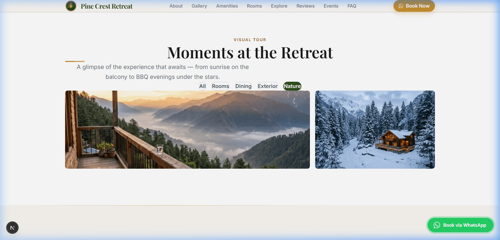
</p>

### 🔍 Performance, SEO & Accessibility
- **WCAG AA Compliant**: Handcrafted color contrast for text and link elements (`#9A6715` contrast ratio of 4.9:1 against light backgrounds).
- **Full Form Accessibility**: Every input field is explicitly bound to descriptive `<label>` tags with matching `id`/`htmlFor` and ARIA dialog semantics.
- **Dynamic Structured Data**: Automated `LodgingBusiness` and `AggregateRating` Schema.org JSON-LD injected in layout head for rich search engine results.
- **Native Next.js Sitemaps**: Dynamic `sitemap.xml` and `robots.txt` generation.
- **Optimized Assets**: All gallery images compressed from raw camera outputs down to lightweight web assets (~150KB) with zero visible fidelity loss.

---

## 🛠 Tech Stack

| Layer | Technology | Purpose |
| :--- | :--- | :--- |
| **Framework** | [Next.js 16](https://nextjs.org/) (App Router, Turbopack) | High-performance server rendering & static route optimization |
| **UI Library** | [React 19](https://react.dev/) | Modern concurrent component architecture |
| **Styling** | [Tailwind CSS v4](https://tailwindcss.com/) & CSS Custom Properties | Ultra-fast styling with dynamic runtime color theming |
| **Animation** | [Framer Motion 13](https://www.framer.com/motion/) | Smooth entrance animations, accordions, and modal transitions |
| **Icons** | [Lucide React](https://lucide.dev/) | Crisp, consistent SVG icons |
| **Typography** | Google Fonts (`Playfair Display` & `Inter`) | Elegant luxury editorial styling paired with readable body typography |
| **Analytics** | [@vercel/analytics](https://vercel.com/analytics) | Real-time visitor insights with zero setup |
| **Deployment** | [Vercel](https://vercel.com/) | Edge network global distribution and dynamic asset optimization |

---

## 🎨 White-Label / Rebranding in 5 Minutes

This template is engineered specifically for agencies and developers delivering custom hotel websites. You only need to touch **one file**:

```
src/config/site.config.ts
```

### What You Can Customize:
1. **Property Identity**: Name, tagline, description, elevation, location coordinates, and story paragraphs.
2. **Brand Colors**: Primary deep tone, gold accent, and light background. All CSS tokens update automatically.
3. **WhatsApp Number**: International format number receiving the structured booking payloads.
4. **Rooms & Packages**: Title, descriptions, nightly rates, capacity limits, amenities, and image arrays.
5. **Photo Gallery**: Add, remove, or re-categorize images in the photo tour.
6. **Local Attractions**: Drive times, photos, and Google search queries for nearby destinations.
7. **Social Media & FAQs**: Easily toggled or extended.
8. **Agency Attribution**: Footer agency credit ("Developed by ...") can be enabled, customized, or disabled via `showAgencyCredit`.

---

## ⚙️ Getting Started

### Prerequisites
- Node.js 18.18+ or 20+
- npm, yarn, or pnpm

### 1. Clone the Repository
```bash
git clone https://github.com/QIsrar/QI-Hotels-demo.git
cd QI-Hotels-demo/qi-tourism-template
```

### 2. Install Dependencies
```bash
npm install
```

### 3. Run Development Server
```bash
npm run dev
```
Open [http://localhost:3000](http://localhost:3000) with your browser to see the result.

### 4. Build for Production
```bash
npm run build
npm run start
```

---

## 📁 Project Structure

```
qi-tourism-template/
├── public/
│   ├── images/              # Optimized property & room photography
│   └── readme-assets/       # Portfolio presentation screenshots
├── src/
│   ├── app/
│   │   ├── globals.css      # Core design tokens, @theme, & color-mix utilities
│   │   ├── layout.tsx       # Root layout, dynamic CSS variable injection, Schema.org
│   │   ├── page.tsx         # Assembled landing page
│   │   ├── robots.ts        # Next.js native robots.txt
│   │   └── sitemap.ts       # Next.js native sitemap.xml
│   ├── components/
│   │   ├── Navbar.tsx       # Fixed navigation with logo and persistent CTA
│   │   ├── sections/        # Modular page sections (Hero, Story, Gallery, Rooms, etc.)
│   │   └── ui/              # BookingWizard, AvailabilitySearch, Popup, WhatsAppCTA
│   ├── config/
│   │   └── site.config.ts   # 🌟 SINGLE SOURCE OF TRUTH FOR ALL CONTENT & BRANDING
│   └── lib/
│       └── whatsapp.ts      # Deep-link payload formatting and URL builder
└── next.config.ts           # Next.js runtime image optimization settings
```

---

## 📸 Preview

Device-framed visual captures from the [live production deployment](https://qi-hotels.vercel.app), showcasing key guest touchpoints, interactive workflows, and responsive views:

| Desktop Landing & Hero | WhatsApp Booking Flow |
| :---: | :---: |
| 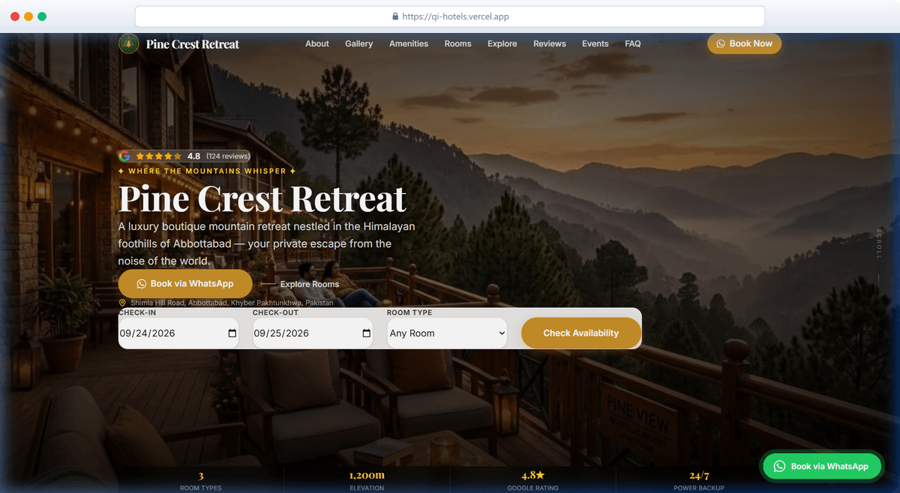 | 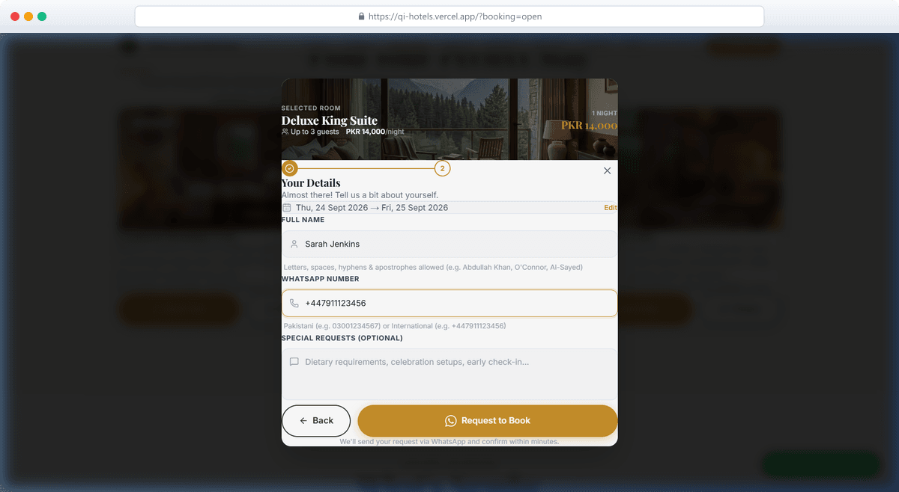 |
| **Desktop Landing & Hero**<br />*Floating glass availability search card over full-bleed hero banner* | **WhatsApp Booking Flow**<br />*2-step modal calculating nights, room tier, live pricing, and WhatsApp payload* |

| Accommodation Showcase | High-Res Photography Lightbox |
| :---: | :---: |
| 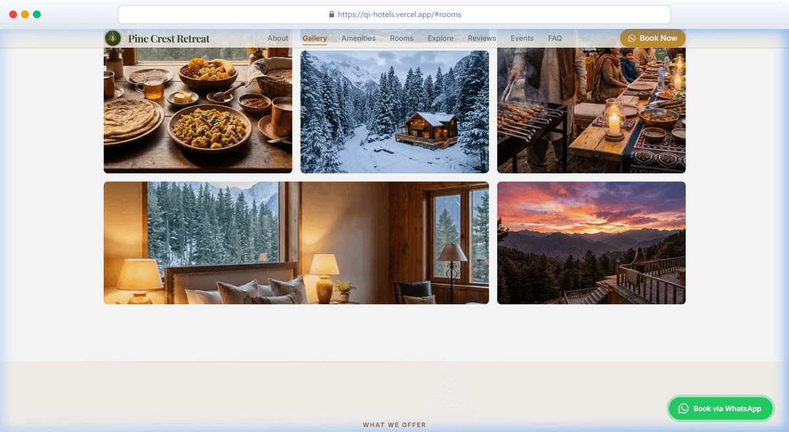 | 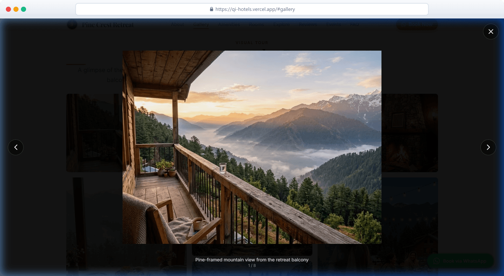 |
| **Accommodation Showcase**<br />*Categorized suite cards with amenity badges, price tags, and date sync* | **High-Res Photography Lightbox**<br />*Full-screen gallery with category filtering, slide counter, and keyboard navigation* |

| Mobile Responsive View | Footer & Newsletter |
| :---: | :---: |
| 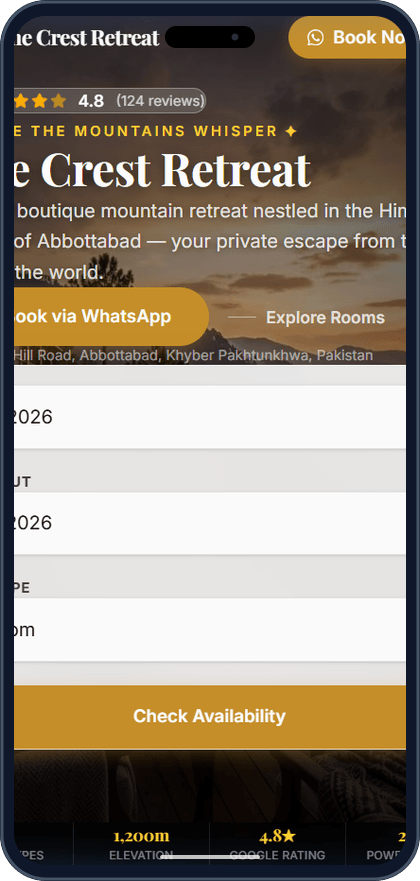 | 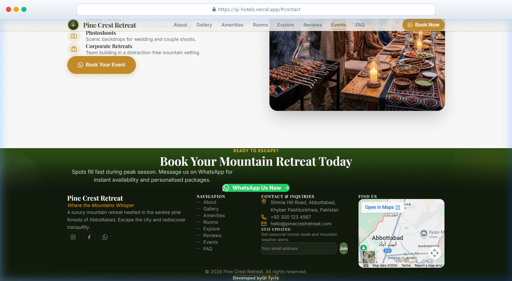 |
| **Mobile Responsive View**<br />*Pixel-perfect 375px mobile viewport with touch drawer and quick WhatsApp CTA* | **Footer & Newsletter**<br />*Deep-tone brand gradient footer with inline non-blocking subscription status* |

---

## 📄 License

Distributed under the **MIT License**. See `LICENSE` for more information.

---

<p align="center">
  Crafted with precision by <a href="https://qi-tyrix.netlify.app"><strong>QI Tyrix</strong></a>.
</p>
